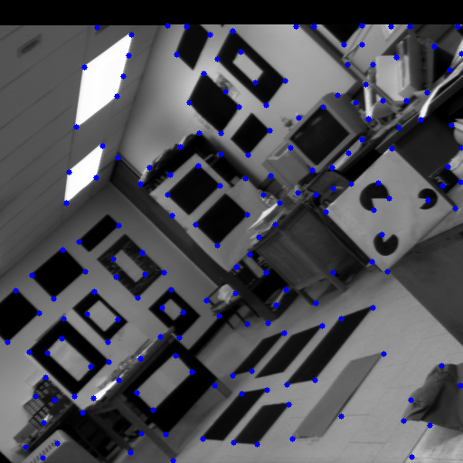

# Low-Complexity Pruning for Accelerating Corner Detection

This is the implementation of Shi-Tomasi-Corner detection in low-complexity version, the method is from [Low-Complexity Pruning for Accelerating Corner Detection](https://ieeexplore.ieee.org/document/6271582),

the basic algorithm flow is


and you can refer the paper for more algorithm detail.

**usage**

```
mkdir build
cd build
cmake ..
cmake --build
cd ../prebuilt
./corner_detect xxx.jpg

```

and you will get the result xxx.jpg image under prebuilt/ folder

**config.json**

modify configuration as you need.

```json
{
    "max_corner":500,
    "min_dist":20,
    "t1":0.01,
    "t2":0.01
}
```


## Result

**blox**

```
There are  7791 corner candidate, 88.11 % corners be punned 
There are 2553 corners to be detected!
There are 49 corners after NMS
```


**chess**

```
There are  1692 corner candidate, 98.91 % corners be punned 
There are 1620 corners to be detected!
There are 108 corners after NMS

```


**house**

```
There are  9016 corner candidate, 86.24 % corners be punned 
There are 2287 corners to be detected!
There are 43 corners after NMS

```


**lab**

```
There are  49096 corner candidate, 81.27 % corners be punned 
There are 7457 corners to be detected!
There are 183 corners after NMS

```




## Reference

- [Low-Complexity Pruning for Accelerating Corner
Detection](https://www3.ntu.edu.sg/home/ASSKLam/Paper/2012A-Wu-ISCAS.pdf)

- [An Analysis and Implementation of the Harris Corner
Detector](http://www.ipol.im/pub/art/2018/229/article_lr.pdf)

- https://github.com/coder-mano/Shi-Tomasi-Corner-Detector


